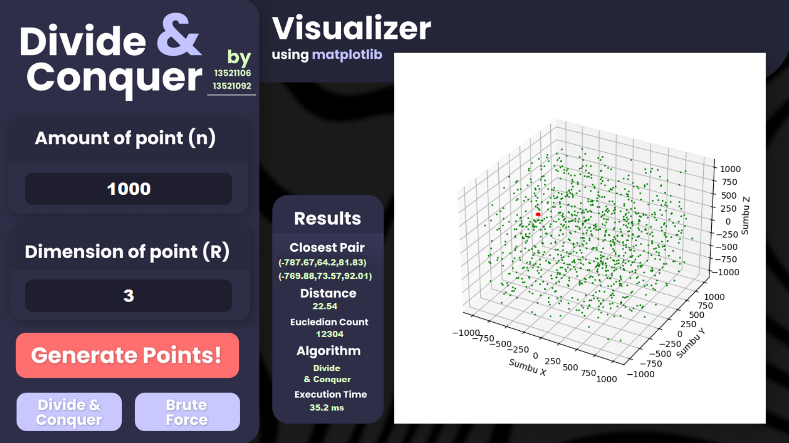

# Mencari Pasangan Titik Terdekat 3D dengan Algoritma Divide and Conquer



Mencari sepasang titik terdekat dengan Algoritma Divide and Conquer sudah dijelaskan di dalam kuliah. Persoalan tersebut dirumuskan untuk titik pada bidang datar (2D). Pada Tucil 2 kali ini Anda diminta mengembangkan algoritma mencari sepasang titik terdekat pada bidang 3D. Misalkan terdapat n buah titik pada ruang 3D. Setiap titik P di dalam ruang dinyatakan dengan koordinat `P = (x, y, z)`. Carilah sepasang titik yang mempunyai jarak terdekat satu sama lain. Jarak dua buah titk `P1 = (x1, y1, z1) dan P2 = (x2, y2, z2)` dihitung dengan rumus Euclidean berikut:

$$
d = \sqrt{(x_2 - x_1)^2 + (y_2 - y_1)^2 + (z_2 - z_1)^2}
$$

## Group Members
| NIM      | Name                        | Tugas                                   |
| -------- | --------------------------- |-----------------------------------------|
| 13521092 | Frankie Huang               | Divide and Conquer algorithm, Bonus 2   |
| 13521106 | Mohammad Farhan Fahrezy     | Brute Force algorithm, I/O, GUI         |

## About this project
- Solves closest pair problem in 3D or up with either brute force or divide and conquer algorithm.
- GUI display implemented using `tkinter`
- Asks for number of points and dimension beforehand to generate random points
- Programmed in `python v.3.10.9` or up

## Features

The features below are 100% done and implemented.
- Brute-Force algorithm solution
- Divide and Conquer algorithm solution
- Both algorithm generalized up to the N-th dimension
- A simple and working GUI

## Requirements
- Latest `Python 3` version
- `matplotlib`
- `tkinter`

## Setup
Make sure all requirements are installed in your local machine beforehand. Then, clone this repository.
```bash
git clone git@github.com:farhanfahreezy/Tucil2_13521092_13521106.git
```

Change to the repository directory, then run the `mainWindows.py` file.
```bash
cd Tucil2_13521092_13521106
python src/mainWindows.py
```

## Program Structure

```
│ README.md
│ .gitignore
│
├─── doc
│     ├─ Tucil2_13521092_13521106.docx
│     └─ Tucil2_13521092_13521106.pdf
│
└─── src
      ├─ assets
      │    ├─ button_1.png
      │    ├─ button_2.png
      │    ├─ button_3.png
      │    ├─ button_4.png
      │    ├─ entry_1.png
      │    ├─ entry_2.png
      │    └─ image_1.png
      ├─ bruteForce.py
      ├─ displayCoordinate.py
      ├─ divideAndConquer.py
      ├─ generateCoordinate.py
      ├─ main.py
      ├─ mainWindows.py
      └─ utilities.py
```

## Project Status
This project is *finished*.

*There are no plans to change, add, or optimize the program in the near future.*

## Room for Improvement
- More efficient divide and conquer algorithm
- Snappier GUI

## Acknowledgements
- This project is spearheaded by the IF2211 Informatics major at Institut Teknologi Bandung, which has been well organized by the IF2211 - 2023 professors and assistants.
- README template by [@flynerdpl](https://www.flynerd.pl/): [README](https://github.com/ritaly/README-cheatsheet)
- Thanks to the reference sources and methods as a basis that have been listed in the relevant parts of the report.
